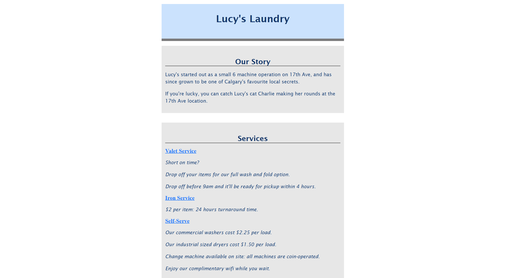

# Lucy's Laundry

## 📌 Project Overview
This project is a simple, responsive webpage for **Lucy's Laundry**, created as part of a school assignment. It demonstrates the application of **CSS for typography and layout**, following the **BEM methodology** and proper **HTML semantics**.

## 🌐 Live Demo
🔗 [View the live website](https://jayco01.github.io/lucys-laundry/)



## 🛠️ Technologies Used
- **HTML5** (semantic structure)
- **CSS3** (modern styling techniques)
- **BEM Methodology** (for organized and scalable CSS)
- **GitHub Pages** (for hosting the live demo)

## 📂 Project Structure
```
lucys-laundry/
│\── index.html          # Main HTML file
│\── styles/
│   ├── styles.css      # Main CSS file
│\── images/             # Folder for images
│\── README.md           # Project documentation
```

## 📚 Features
✅ Clean and **minimalist layout**  
✅ **Responsive design** using modern CSS techniques  
✅ **Properly structured HTML** with **semantic elements**  
✅ **BEM class naming** for maintainable CSS  

## 🚀 How to Run the Project Locally
1. **Clone the repository**:
   ```sh
   git clone https://github.com/jayco01/lucys-laundry.git
   ```
2. **Open `index.html` in a browser** to view the webpage.

## 📝 License
This project is for educational purposes and does not include a license.

---
💡 **Feel free to improve or expand upon this project!** 🚀  